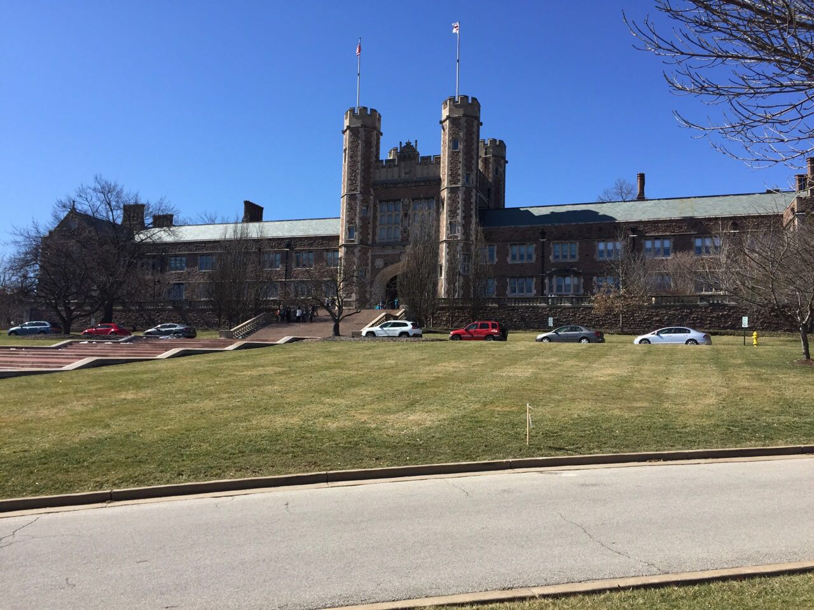
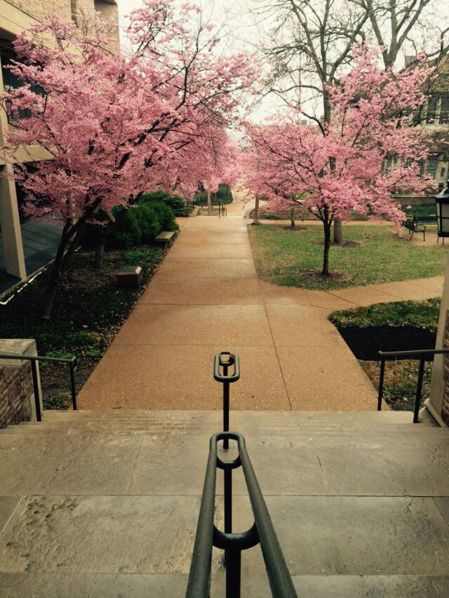
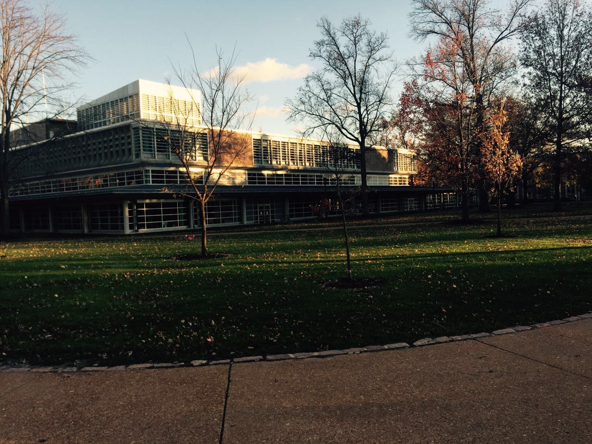
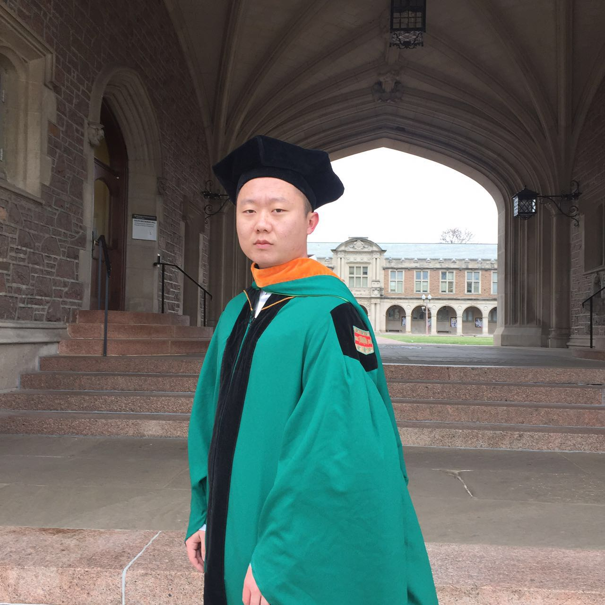
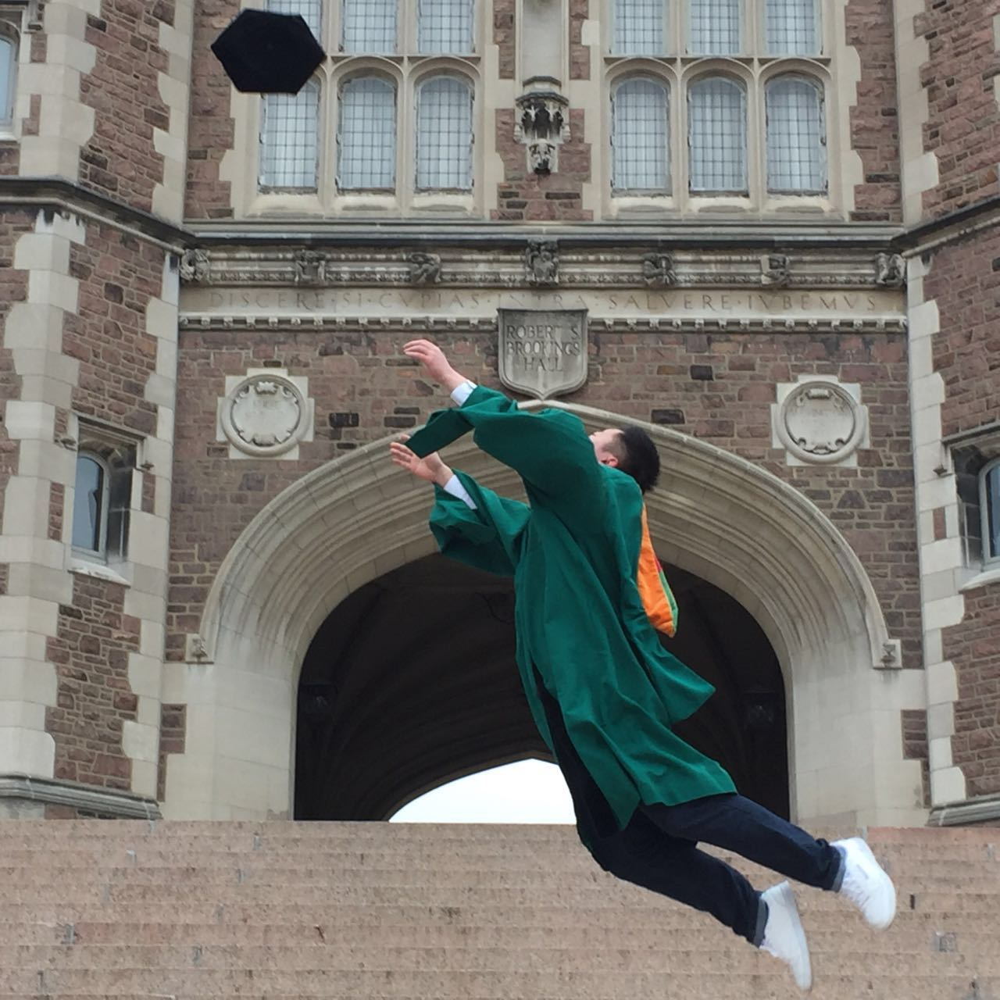
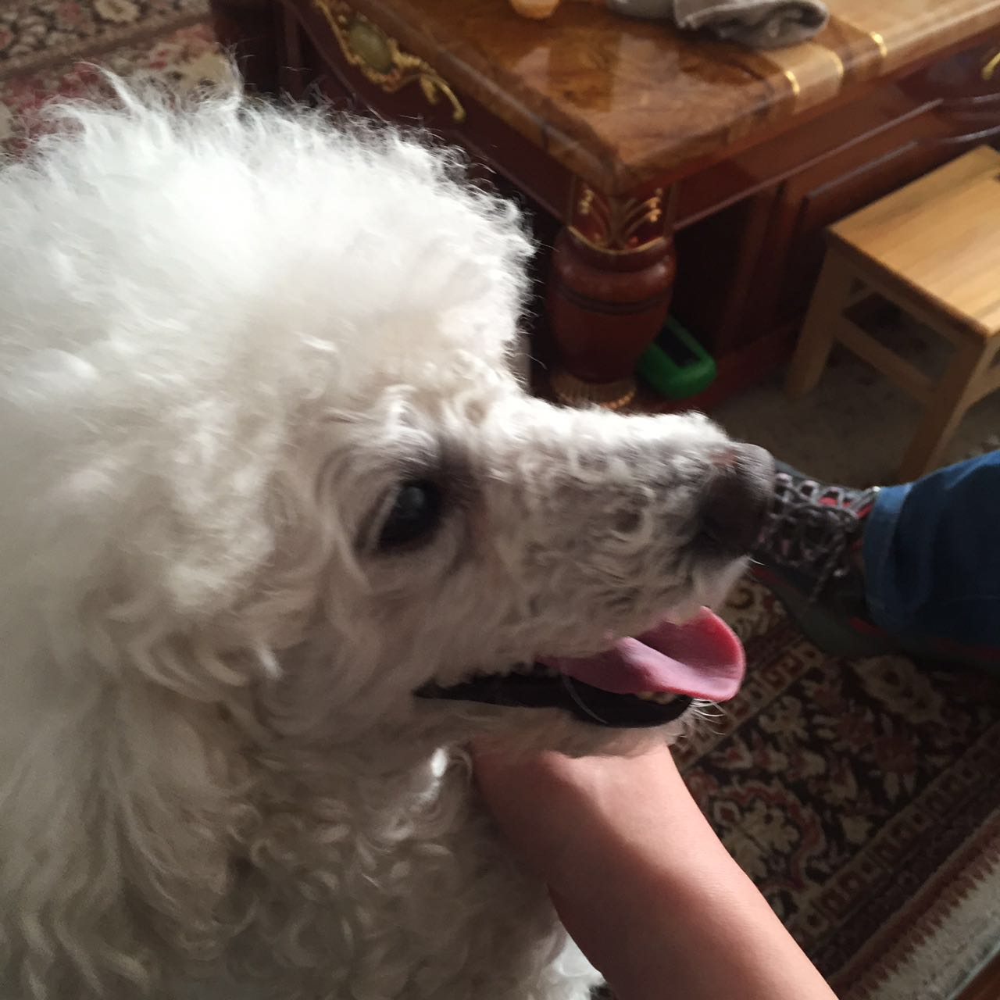
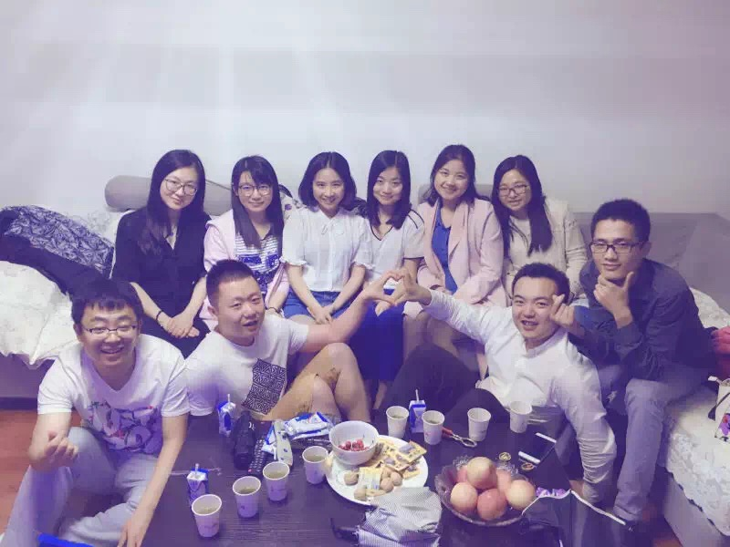

# 联系信息
* 姓名:王玮 (Ray)
* 邮箱:wangwei407@wustl.edu
* QQ:1010288625
* 电话:13933997555
* 爱逛知乎,[quora](https://www.quora.com),csdn,[coursera](https://www.coursera.org)
* 喜欢新鲜事物，对技术充满了热情

### 简短描述
大家好！ 我叫王玮，来自山城河北[张家口](http://baike.baidu.com/link?url=H19qEVJLWxKkCaoQFigv89xKUU2RVBkWTnjZwCmVZpzimYLDsaQgwfa0O9WIvUWbNUm7gKwtpA9Vt7CBADiQMOfP4xUxONHPPnyyWZ4Imh-i12RsN2tqcqGg91VN4eXG)(不是张家界，也不是张家港)的一个军人家庭. 我本科毕业于[安徽工业大学](http://baike.baidu.com/item/安徽工业大学)，研究生毕业于[华盛顿圣路易斯大学](http://baike.baidu.com/link?url=K9hRUabT2WGs4bQB4ytuJ5vbjcLzsITTfD1pRzh_I_DdF-hKVTfnrbVM84aZdH1edaktW7qTHBXSBy1NcUCpKd2xtAxaHa43k1BO9wpOLh6WApjZT9LGQJrg_Smx6pWrJcQ4snyn603JD9vkbI5exXOLw7bBfKec8c9AYc54jq_rbzl-hePk_PANhNqNbtJ3)(大数据预测方向).和大家分享一下华大的校园:) 

从研究生开始，我便对数据科学产生了浓厚的兴趣，通过两年的学习，对大数据有了初步的了解(分布式计算平台以及机器学习算法).2016年12月，我研究生毕业，并励志做一个大数据工程师.机缘巧合之下,我了解到talkingdata，并有幸担任大数据工程师的职位并且能与各位有才能的人共事。这是我毕业时的照片:  

#### 比较正常的
  

#### 比较跳的  

  

#### 个人生活方面，我热爱游泳，健身(最后一个学期太忙,一不小心胖了20斤)，喜欢养宠物.这是我家养了七年的贵妇:

  

#### 我为人幽默对人真诚因此有很多朋友,这是今年夏天参加室友婚礼时的照片:  

#### 最后,我很荣幸能与各位成为同事以及朋友,希望在将来的工作中,一起成长！
